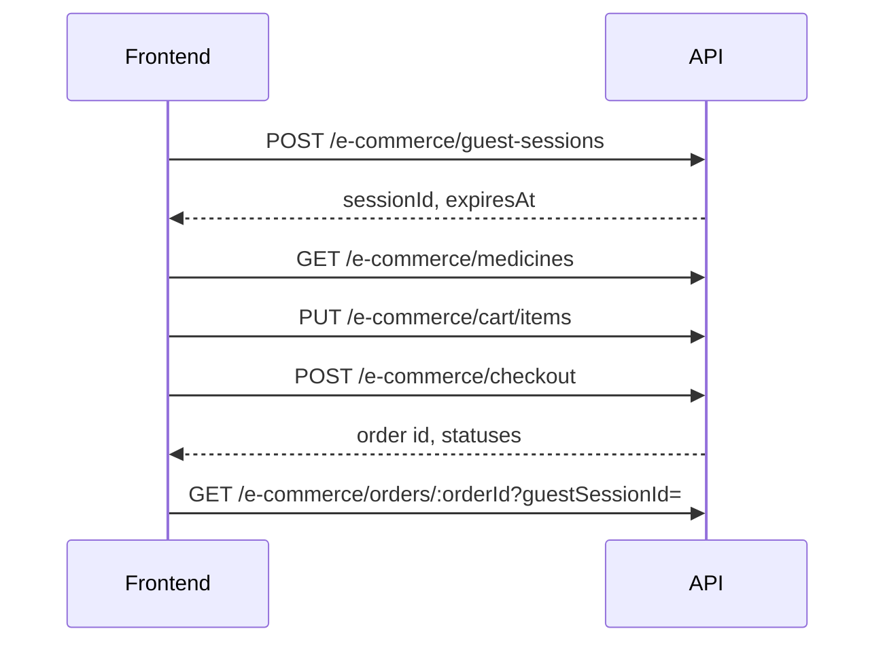

# Health Bridge API — Frontend Integration Reference

This document describes every **currently exposed** HTTP API in the Health Bridge backend and how a web or mobile client should integrate with it.

> **Live contract:** OpenAPI is served at `GET /docs-json` and interactive docs at `GET /docs` when the server is running (default port **5000**).

---

## Table of contents

1. [Product features](#product-features)
2. [Base URL and conventions](#base-url-and-conventions)
3. [Authentication](#authentication)
4. [Common headers](#common-headers)
5. [Errors, validation, and rate limits](#errors-validation-and-rate-limits)
6. [Integration flows (recommended order)](#integration-flows-recommended-order)
7. [API reference](#api-reference)
   - [App](#app)
   - [Auth](#auth)
   - [E-commerce (guest medicine)](#e-commerce-guest-medicine)
   - [Appointments (in-person)](#appointments-in-person)
   - [Lab tests](#lab-tests)
   - [Ambulance (emergency transport)](#ambulance-emergency-transport)
   - [Files](#files)
8. [Enums and status machines](#enums-and-status-machines)
9. [Planned but not exposed yet](#planned-but-not-exposed-yet)
10. [Environment variables (frontend-relevant)](#environment-variables-frontend-relevant)

---

## Product features

### Implemented (HTTP APIs available)

| Feature | Audience | Auth | Summary |
|--------|----------|------|---------|
| **Auth** | Patient, Doctor | Public signup/signin | JWT access + refresh tokens; role in token |
| **Guest medicine commerce** | Anyone (guest) | None | Session → browse → cart → checkout → track order |
| **In-person appointments** | Patient, Doctor | Bearer JWT | Search doctors, book slots (UTC), manage availability |
| **Lab test booking** | Patient, Admin | Bearer JWT | Centers, tests, packages, booking, sample lifecycle, reports |
| **Anonymous lab report access** | Anyone with token | None | Download report metadata via `reportToken` |
| **Emergency ambulance** | Patient, Driver, Dispatcher, Admin | Bearer JWT | Request ride, dispatch, live location, driver lifecycle |
| **File proxy** | Anyone | None | Stream files stored in R2 via `/file/{objectKey}` |

### In database / roadmap (no public routes yet)

Telehealth (on-demand video), standalone payment APIs, notification webhooks, patient/doctor/admin dashboards, authenticated medicine orders. Schema exists for some of these; controllers are not wired in `AppModule` yet.

---

## Base URL and conventions

| Item | Value |
|------|--------|
| Default origin | `http://localhost:5000` (override with `PORT`) |
| API prefix | **None** — routes are rooted at `/` (e.g. `/auth/signin`) |
| Request body | `Content-Type: application/json` unless noted (multipart for lab report upload) |
| Response body | JSON (except file stream on `/file/*`) |
| IDs | UUID v4 strings |
| Money | Decimal fields are returned as **strings** (e.g. `"37.50"`) in commerce; Prisma `Decimal` fields elsewhere are typically serialized as strings in JSON |
| Dates in queries | Calendar days: `YYYY-MM-DD` (interpreted as **UTC midnight** for appointments) |
| Times | `HH:mm` 24-hour (appointments / lab sample time) |
| Phone | E.164-style: `^\+?[1-9]\d{7,14}$` |

**Swagger:** After `yarn start:dev`, visit `/docs` or fetch `/docs-json` for machine-readable OpenAPI (includes `@ApiBearerAuth` on protected routes).

---

## Authentication

### Sign up (`POST /auth/signup`)

- **Allowed roles:** `PATIENT`, `DOCTOR` only (not `ADMIN`, `DISPATCHER`, `DRIVER`).
- **Doctor extra fields:** `licenseNumber`, `specialization`, `qualification` are **required** when `role` is `DOCTOR`.

### Sign in (`POST /auth/signin`)

- `identity`: email **or** phone (matched case-insensitively for email).
- Returns the same token shape as signup.

### Using the access token

Send on every protected route:

```http
Authorization: Bearer <accessToken>
```

JWT payload (for debugging only — **do not trust client-side for authorization**):

```json
{
  "sub": "<userId>",
  "role": "PATIENT",
  "email": "user@example.com",
  "iat": 1710000000,
  "exp": 1710000900
}
```

| Token | TTL | Notes |
|-------|-----|--------|
| Access | **15 minutes** (`AUTH_ACCESS_TOKEN_TTL`) | Used in `Authorization` header |
| Refresh | **7 days** | Returned on signup/signin; **no refresh HTTP endpoint is implemented yet** — store securely and plan for re-signin until `/auth/refresh` exists |

### Role-based access

Protected controllers use `JwtAuthGuard` + `RolesGuard`. If the user’s `role` is not in the route’s allowed list, the API returns **403** with message `Insufficient role permission`.

| Role | Typical surfaces |
|------|------------------|
| `PATIENT` | Lab bookings, ambulance request, appointments, commerce (future) |
| `DOCTOR` | Appointment availability & schedule |
| `ADMIN` | Lab catalog ops, ambulance fleet, centers, reports |
| `DISPATCHER` | Ambulance queue, dispatch, shifts |
| `DRIVER` | Assigned booking lifecycle, location push |

---

## Common headers

| Header | When | Value |
|--------|------|--------|
| `Authorization` | Protected routes | `Bearer <accessToken>` |
| `Content-Type` | JSON bodies | `application/json` |
| `Idempotency-Key` | Optional | Client UUID for **lab** `POST /lab/bookings` and **ambulance** `POST /ambulance/bookings` — replays return the cached booking within TTL |
| `User-Agent` | Optional | Sent on guest session / signin (server logging) |

There is **no** `Accept-Version` or global correlation-id header today; you may send `X-Request-Id` for your own logging (ignored by server).

---

## Errors, validation, and rate limits

### Error shape (NestJS default)

```json
{
  "statusCode": 400,
  "message": "Human-readable or array of validation messages",
  "error": "Bad Request"
}
```

- **400** — validation / business rule (`BadRequestException`)
- **401** — missing or invalid JWT (`UnauthorizedException`)
- **403** — wrong role or resource access (`ForbiddenException`)
- **404** — not found
- **409** — conflict (duplicate email, slot taken, etc.)
- **429** — throttler (`ThrottlerGuard`); global default **60 requests / 60s** per IP unless route overrides

### Validation

- **class-validator** on auth and most lab/ambulance/appointment DTOs (`whitelist: true`, `forbidNonWhitelisted: true`).
- **Zod** on e-commerce cart/checkout/query via `ZodValidationPipe` — same 400 shape.

### Per-route throttle examples

| Route | Limit |
|-------|--------|
| `POST /auth/signup` | 5 / min |
| `POST /auth/signin` | 10 / min |
| `POST /lab/bookings` | 10 / min |
| `POST /ambulance/bookings` | 5 / min |
| `POST /ambulance/bookings/:id/location` | 120 / min |
| `POST /appointments` | 30 / min |

---

## Integration flows (recommended order)

### 1. Guest medicine (no account)



Persist `sessionId` in `localStorage` / secure storage until checkout completes. Guest session TTL: **7 days**.

### 2. Patient lab test

1. `POST /auth/signin` (role `PATIENT`)
2. `GET /lab/centers` → pick center
3. `GET /lab/centers/:centerId/tests` and/or `packages`
4. `POST /lab/bookings` with `Idempotency-Key` header (recommended)
5. Poll `GET /lab/bookings/:bookingId` — `bookingStatus` / `sampleStatus`
6. When report is ready, use `reportToken` from patient report list or email → `GET /lab/reports/token/:reportToken` → open `reportUrl` (points to `/file/...`)

Advance payment is confirmed by admin: `PATCH /lab/bookings/:id/payment/confirm`.

### 3. Patient ambulance

1. Sign in as `PATIENT`
2. `GET /ambulance/health-centers` — user must link **at least one** of `originCenterId` or `destinationCenterId` on create
3. `POST /ambulance/bookings` with coordinates + addresses + optional `Idempotency-Key`
4. Poll `GET /ambulance/bookings/:bookingId` for status (`REQUESTED` → `ACCEPTED` → …)
5. Poll `GET /ambulance/bookings/:id/location` for map (field `source`: `cache` | `db`)
6. Optional: `GET /ambulance/bookings/:id/location/trail` for history

### 4. Patient in-person appointment

1. Sign in as `PATIENT`
2. `GET /appointments/health-centers`
3. `GET /appointments/doctors/search?specialization=&date=YYYY-MM-DD&healthCenterId=`
4. `GET /appointments/doctors/:doctorUserId?date=&healthCenterId=` → `slotsByHealthCentre`
5. `POST /appointments` with `availabilityRuleId`, `date`, `startTime` from an **available** slot
6. `GET /appointments/me/patient?skip=&take=`

All appointment dates/times are **UTC calendar** semantics on the server.

---

## API reference

### App

#### `GET /`

Health check.

| | |
|--|--|
| **Auth** | None |
| **Response 200** | `string` — e.g. `"Hello World!"` |

---

### Auth

Base path: `/auth`

#### `POST /auth/signup`

| | |
|--|--|
| **Auth** | None |
| **Throttle** | 5/min |

**Request body**

```json
{
  "email": "nafisa@example.com",
  "phone": "+8801700000000",
  "password": "SecurePass123",
  "role": "PATIENT",
  "firstName": "Nafisa",
  "lastName": "Rahman",
  "specialization": "Cardiology",
  "qualification": "MBBS, FCPS",
  "licenseNumber": "DMC-12345"
}
```

| Field | Rules |
|-------|--------|
| `email` | Valid email |
| `phone` | E.164-style regex |
| `password` | 8–72 chars |
| `role` | `PATIENT` \| `DOCTOR` |
| `specialization`, `qualification`, `licenseNumber` | Required if `role` is `DOCTOR` |

**Response 200**

```json
{
  "accessToken": "<jwt>",
  "refreshToken": "<jwt>"
}
```

| Status | Meaning |
|--------|---------|
| 400 | Invalid role or missing doctor fields |
| 409 | Email or phone already exists |

---

#### `POST /auth/signin`

| | |
|--|--|
| **Auth** | None |
| **Throttle** | 10/min |

**Request body**

```json
{
  "identity": "nafisa@example.com",
  "password": "SecurePass123"
}
```

`identity` may be email or phone.

**Response 200** — same as signup.

| Status | Meaning |
|--------|---------|
| 401 | Invalid credentials |

---

### E-commerce (guest medicine)

Base path: `/e-commerce` — **all routes are public** (no Bearer token).

#### `POST /e-commerce/guest-sessions`

Creates a guest session (Redis-backed cart).

**Response 201**

```json
{
  "sessionId": "uuid",
  "expiresAt": "2026-06-07T10:00:00.000Z"
}
```

Session TTL: **7 days**.

---

#### `GET /e-commerce/categories`

**Response 200** — array:

```json
[
  {
    "id": "uuid",
    "name": "Pain Relief",
    "description": null,
    "medicineCount": 8
  }
]
```

---

#### `GET /e-commerce/medicines`

**Query parameters**

| Param | Type | Description |
|-------|------|-------------|
| `categoryId` | uuid | Filter by category |
| `search` | string | Name search (1–120 chars) |
| `requiresPrescription` | boolean | Filter Rx vs OTC |
| `inStockOnly` | boolean | Default behavior favors in-stock in service |

**Response 200** — array:

```json
[
  {
    "id": "uuid",
    "categoryId": "uuid",
    "categoryName": "Pain Relief",
    "name": "Napa 500mg",
    "genericName": "Paracetamol",
    "manufacturer": "Beximco",
    "price": "12.50",
    "stockQuantity": 18,
    "requiresPrescription": false,
    "status": "ACTIVE"
  }
]
```

---

#### `GET /e-commerce/cart/:guestSessionId`

**Response 200**

```json
{
  "guestSessionId": "uuid",
  "items": [
    {
      "medicineId": "uuid",
      "medicineName": "Napa 500mg",
      "genericName": "Paracetamol",
      "quantity": 2,
      "unitPrice": "12.50",
      "totalPrice": "25.00",
      "requiresPrescription": false
    }
  ],
  "totalItems": 2,
  "subtotal": "25.00",
  "expiresAt": "2026-06-07T10:00:00.000Z"
}
```

| Status | Meaning |
|--------|---------|
| 404 | Unknown session |

---

#### `PUT /e-commerce/cart/items`

Add or replace line quantity (max **20** per SKU).

**Request body**

```json
{
  "guestSessionId": "uuid",
  "medicineId": "uuid",
  "quantity": 2
}
```

**Response 200** — `CartResponseDto` (same shape as GET cart).

---

#### `DELETE /e-commerce/cart/items/:guestSessionId/:medicineId`

**Response 200** — updated cart.

---

#### `POST /e-commerce/checkout`

**Request body**

```json
{
  "guestSessionId": "uuid",
  "paymentMethod": "CASH",
  "deliveryAddress": "House 12, Road 3, Dhanmondi, Dhaka",
  "deliveryPhone": "+8801700000000",
  "idempotencyKey": "checkout-guest-2026-0001"
}
```

| Field | Notes |
|-------|--------|
| `paymentMethod` | `ONLINE` \| `CASH` |
| `idempotencyKey` | 8–120 chars; duplicate key returns same order |

**Response 201**

```json
{
  "id": "uuid",
  "userId": null,
  "guestSessionId": "uuid",
  "totalAmount": "37.50",
  "discountAmount": "0.00",
  "taxAmount": "0.00",
  "finalAmount": "37.50",
  "paymentMethod": "CASH",
  "paymentStatus": "PENDING_CASH",
  "deliveryStatus": "PENDING",
  "deliveryAddress": "...",
  "deliveryPhone": "+880...",
  "items": [
    {
      "medicineId": "uuid",
      "medicineName": "Napa 500mg",
      "quantity": 2,
      "unitPrice": "12.50",
      "totalPrice": "25.00"
    }
  ],
  "createdAt": "2026-05-31T12:00:00.000Z"
}
```

---

#### `GET /e-commerce/orders/:orderId`

**Query:** `guestSessionId` (required, uuid)

**Response 200** — `OrderResponseDto` (must match session).

---

### Appointments (in-person)

Base path: `/appointments` — **all routes require** `Authorization: Bearer`.

#### `GET /appointments/health-centers`

| Roles | `PATIENT`, `DOCTOR` |

**Response 200** — array of health centers (includes `type`: `HOSPITAL` | `CLINIC` | `DIAGNOSTIC_CENTER`).

---

#### `GET /appointments/doctors/search`

| Roles | `PATIENT` |

**Query**

| Param | Required | Example |
|-------|----------|---------|
| `specialization` | yes | `Cardio` (substring, case-insensitive) |
| `date` | yes | `2026-05-12` |
| `healthCenterId` | no | uuid — filters doctors/slots to one centre |

**Response 200**

```json
[
  {
    "doctorUserId": "uuid",
    "fullName": "Dr. Karim Ahmed",
    "specialization": "Cardiology",
    "freeSlotCount": 4
  }
]
```

---

#### `GET /appointments/doctors/:doctorUserId`

| Roles | `PATIENT` |

**Query:** `date` (required), `healthCenterId` (optional)

**Response 200**

```json
{
  "doctorUserId": "uuid",
  "fullName": "Dr. Karim Ahmed",
  "specialization": "Cardiology",
  "consultationFee": "800.00",
  "doctorPhone": "+8801...",
  "freeSlotCount": 4,
  "healthCentres": [
    {
      "id": "uuid",
      "name": "City Clinic",
      "address": "...",
      "city": "Dhaka",
      "state": "Dhaka",
      "zipCode": "1205",
      "phone": "...",
      "email": "..."
    }
  ],
  "slotsByHealthCentre": [
    {
      "healthCenter": { "id": "...", "name": "...", "...": "..." },
      "slots": [
        {
          "availabilityRuleId": "uuid",
          "healthCenterId": "uuid",
          "startTime": "10:20",
          "durationMinutes": 20,
          "available": true
        }
      ]
    }
  ]
}
```

---

#### `POST /appointments`

| Roles | `PATIENT` |

**Request body**

```json
{
  "availabilityRuleId": "uuid",
  "date": "2026-05-14",
  "startTime": "10:20",
  "reasonForVisit": "Chest pain follow-up"
}
```

**Response 201** — Prisma `Appointment` with `healthCenter` included (status default `SCHEDULED`). Fee copied from doctor profile at booking time.

| Status | Meaning |
|--------|---------|
| 409 | Slot no longer available |
| 404 | Rule/doctor inactive |

---

#### `GET /appointments/me/patient`

| Roles | `PATIENT` |

**Query:** `skip` (default 0), `take` (default 20, max 100)

**Response 200**

```json
{
  "items": [ /* appointments with doctor + healthCenter */ ],
  "total": 12,
  "skip": 0,
  "take": 20
}
```

---

#### `GET /appointments/me/doctor`

| Roles | `DOCTOR` |

**Query:** `from`, `toInclusive` (`YYYY-MM-DD`), `healthCenterId` (optional)

Default range: from **today UTC** through **7** inclusive day offsets.

**Response 200** — array of appointments with `patient` + `healthCenter`.

---

#### `GET /appointments/me/doctor/availability`

| Roles | `DOCTOR` |

**Response 200** — availability rows with nested `healthCenter`.

---

#### `POST /appointments/me/doctor/availability`

| Roles | `DOCTOR` |

**Request body**

```json
{
  "healthCenterId": "uuid",
  "startTime": "09:00",
  "endTime": "12:00",
  "slotDurationMinutes": 20,
  "isRecurring": true,
  "dayOfWeek": "MONDAY",
  "specificDate": "2026-06-01"
}
```

| Rule | |
|------|--|
| Recurring | `dayOfWeek` required; `specificDate` omitted |
| One-off | `isRecurring: false`, `specificDate` required |

**Response 201** — created availability row.

---

#### `PATCH /appointments/me/doctor/availability/:availabilityId`

| Roles | `DOCTOR` |

**Request body** — partial fields from create DTO.

**Response 200** — updated row.

---

#### `DELETE /appointments/me/doctor/availability/:availabilityId`

| Roles | `DOCTOR` |

**Response 204** — no body.

---

### Lab tests

Base path: `/lab`

#### Authenticated routes

All below require `Authorization: Bearer` unless noted.

| Method | Path | Roles | Purpose |
|--------|------|-------|---------|
| GET | `/lab/centers` | PATIENT, ADMIN | List diagnostic centers |
| POST | `/lab/centers` | ADMIN | Create center |
| GET | `/lab/centers/:centerId/tests` | PATIENT, ADMIN | List tests |
| POST | `/lab/centers/:centerId/tests` | ADMIN | Create test |
| PATCH | `/lab/tests/:testId` | ADMIN | Update test |
| GET | `/lab/tests/search` | PATIENT, ADMIN | Search tests |
| GET | `/lab/centers/:centerId/packages` | PATIENT, ADMIN | List packages |
| POST | `/lab/centers/:centerId/packages` | ADMIN | Create package |
| PATCH | `/lab/packages/:packageId` | ADMIN | Update package |
| POST | `/lab/bookings` | PATIENT | Create booking |
| GET | `/lab/bookings/me` | PATIENT | My bookings |
| GET | `/lab/bookings` | ADMIN | All bookings |
| GET | `/lab/bookings/:bookingId` | PATIENT, ADMIN | Detail |
| PATCH | `/lab/bookings/:bookingId/cancel` | PATIENT, ADMIN | Cancel |
| PATCH | `/lab/bookings/:bookingId/payment/confirm` | ADMIN | Confirm advance payment |
| PATCH | `/lab/bookings/:bookingId/sample/collect` | ADMIN | Sample → COLLECTED |
| PATCH | `/lab/bookings/:bookingId/sample/process` | ADMIN | → PROCESSING |
| PATCH | `/lab/bookings/:bookingId/sample/complete` | ADMIN | → COMPLETED |
| POST | `/lab/bookings/:bookingId/reports` | ADMIN | Upload report (multipart) |
| GET | `/lab/bookings/:bookingId/reports` | PATIENT, ADMIN | List reports |
| GET | `/lab/reports` | ADMIN | Admin report list |
| GET | `/lab/reports/me` | PATIENT | Patient dashboard reports |
| PATCH | `/lab/reports/:reportId/deliver` | ADMIN | Email patient + mark delivered |

##### `POST /lab/bookings` (patient)

**Headers:** `Idempotency-Key: <uuid>` (optional, recommended)

**Request body**

```json
{
  "diagnosticCenterId": "uuid",
  "items": [
    { "testId": "uuid" },
    { "packageId": "uuid" }
  ],
  "sampleCollectionDate": "2026-06-01",
  "sampleCollectionTime": "09:00",
  "paymentMethod": "CASH",
  "notes": "Fasting required"
}
```

Each item must have **either** `testId` or `packageId`, not both. At least one item required.

**Response 201** — booking object (`bookingStatus` starts `PENDING_PAYMENT`, `sampleStatus` `PENDING`).

##### `GET /lab/bookings/me`

**Query:** `skip`, `take`

**Response 200**

```json
{
  "total": 5,
  "data": [ /* bookings with items + center summary */ ]
}
```

##### `POST /lab/bookings/:bookingId/reports` (admin)

**Content-Type:** `multipart/form-data`

| Field | Type | Required |
|-------|------|----------|
| `file` | binary | yes (PDF, JPEG, PNG; max 10 MB) |
| `testId` | uuid | no |

**Response 201** — report row with `reportToken`, `reportUrl` (`{APP_URL}/file/reports/...`).

---

#### Public route (no auth)

##### `GET /lab/reports/token/:reportToken`

**Response 200**

```json
{
  "reportUrl": "http://localhost:5000/file/reports/{bookingId}/{timestamp}-name.pdf",
  "reportFileName": "result.pdf"
}
```

Use `reportUrl` in browser or iframe; file is served via [Files](#files) proxy.

---

### Ambulance (emergency transport)

Base path: `/ambulance` — **all routes require** Bearer token.

#### Health centers

| Method | Path | Roles |
|--------|------|-------|
| GET | `/ambulance/health-centers` | PATIENT, ADMIN, DISPATCHER |
| POST | `/ambulance/health-centers` | ADMIN |

**Create body (admin):** `name`, `address`, `city`, `state`, `zipCode`, `phone`, `email`, `latitude`, `longitude`, `type` (`HOSPITAL` | `CLINIC` | `DIAGNOSTIC_CENTER`).

#### Fleet & drivers (ops)

| Method | Path | Roles |
|--------|------|-------|
| GET | `/ambulance/fleet` | ADMIN, DISPATCHER |
| POST | `/ambulance/fleet` | ADMIN |
| PATCH | `/ambulance/fleet/:ambulanceId/status` | ADMIN |
| GET | `/ambulance/drivers` | ADMIN, DISPATCHER |
| POST | `/ambulance/drivers` | ADMIN |
| PATCH | `/ambulance/drivers/:driverId/status` | ADMIN |
| PATCH | `/ambulance/drivers/:driverId/verify` | ADMIN |
| POST | `/ambulance/shifts` | ADMIN, DISPATCHER |
| PATCH | `/ambulance/shifts/:shiftId/end` | ADMIN, DISPATCHER |

**Fleet query:** `healthCenterId`, `status`, `onlyWithActiveShift`

#### Patient booking

##### `POST /ambulance/bookings`

| Roles | PATIENT |
| **Header** | `Idempotency-Key` (optional) |

**Request body**

```json
{
  "pickupAddress": "Road 12, Dhanmondi",
  "destinationAddress": "Apollo Hospital ER",
  "pickupLatitude": 23.7461,
  "pickupLongitude": 90.3742,
  "destinationLatitude": 23.8103,
  "destinationLongitude": 90.4125,
  "vehicleTypeRequired": "ADVANCED",
  "emergencyType": "Cardiac",
  "patientCondition": "Chest pain",
  "specialRequirements": "Oxygen",
  "originCenterId": "uuid",
  "destinationCenterId": "uuid"
}
```

**Guardrail:** at least one of `originCenterId` or `destinationCenterId` must reference an existing health center.

**Fare estimate:** `200 BDT` base + `20 BDT` × km (haversine) → `estimatedFare` string on booking.

**Response 201** — booking (may auto-dispatch to nearest available ambulance). Status flow: `REQUESTED` → `ACCEPTED` → `ARRIVED` → `IN_TRANSIT` → `COMPLETED` (or `CANCELLED`).

##### `GET /ambulance/bookings/me`

**Query:** `skip`, `take` (default take 10)

**Response 200:** `{ "items", "total", "skip", "take" }`

#### Ops queue & dispatch

| Method | Path | Roles |
|--------|------|-------|
| GET | `/ambulance/bookings/active` | ADMIN, DISPATCHER |
| GET | `/ambulance/bookings/:bookingId` | PATIENT, ADMIN, DISPATCHER, DRIVER (if assigned) |
| PATCH | `/ambulance/bookings/:bookingId/cancel` | PATIENT (only while `REQUESTED`), ADMIN, DISPATCHER |
| PATCH | `/ambulance/bookings/:bookingId/dispatch` | ADMIN, DISPATCHER |

**Manual dispatch body**

```json
{
  "ambulanceId": "uuid",
  "driverId": "uuid",
  "notes": "Nearest ICU unit",
  "priority": 8
}
```

#### Driver lifecycle

| Method | Path | Roles |
|--------|------|-------|
| PATCH | `/ambulance/bookings/:bookingId/arrive` | DRIVER |
| PATCH | `/ambulance/bookings/:bookingId/start` | DRIVER |
| PATCH | `/ambulance/bookings/:bookingId/complete` | DRIVER |
| POST | `/ambulance/bookings/:bookingId/location` | DRIVER |
| GET | `/ambulance/bookings/:bookingId/location` | PATIENT, ADMIN, DISPATCHER, DRIVER |
| GET | `/ambulance/bookings/:bookingId/location/trail` | PATIENT, ADMIN, DISPATCHER |

**Location push body**

```json
{
  "latitude": 23.75,
  "longitude": 90.37,
  "accuracy": 12.5,
  "address": "Near Road 12",
  "recordedAt": "2026-05-31T12:00:00.000Z"
}
```

**Response 200:** `{ "recorded": true }`

**Live location response**

```json
{
  "ambulanceId": "uuid",
  "bookingId": "uuid",
  "latitude": 23.75,
  "longitude": 90.37,
  "accuracy": 12.5,
  "recordedAt": "2026-05-31T12:00:00.000Z",
  "source": "cache"
}
```

Poll every few seconds on patient map; respect driver throttle (120/min).

---

### Files

#### `GET /file/*`

| | |
|--|--|
| **Auth** | None |
| **Path** | Wildcard — full R2 object key after `/file/` (e.g. `/file/reports/{bookingId}/{file}.pdf`) |

**Response 200** — binary stream, headers:

- `Content-Type` from object metadata
- `Content-Disposition: inline; filename="..."`
- `Cache-Control: private, max-age=3600`

Lab `reportUrl` values already use this pattern via `APP_URL`.

---

## Enums and status machines

### User roles

`PATIENT` | `DOCTOR` | `ADMIN` | `DISPATCHER` | `DRIVER`

### E-commerce

| Enum | Values |
|------|--------|
| `OrderPaymentMethod` | `ONLINE`, `CASH` |
| `OrderPaymentStatus` | `PENDING`, `PENDING_CASH`, `PAID`, `FAILED` |
| `DeliveryStatus` | `PENDING`, `CONFIRMED`, `SHIPPED`, `OUT_FOR_DELIVERY`, `DELIVERED`, `CANCELLED` |

### Lab

| Enum | Values |
|------|--------|
| `TestBookingStatus` | `PENDING_PAYMENT` → `CONFIRMED` / `CANCELLED` → `COMPLETED` |
| `SampleStatus` | `PENDING` → `COLLECTED` → `PROCESSING` → `COMPLETED` → `DELIVERED` |
| `TestPaymentStatus` | `PENDING`, `PAID`, `FAILED` |
| `ReportStatus` | `PENDING` → `READY` → `DELIVERED` → `ARCHIVED` |

### Ambulance

| Enum | Values |
|------|--------|
| `AmbulanceBookingStatus` | `REQUESTED`, `ACCEPTED`, `ARRIVED`, `IN_TRANSIT`, `COMPLETED`, `CANCELLED` |
| `AmbulanceVehicleType` | `BASIC`, `ADVANCED`, `ICU` |
| `AmbulanceStatus` | `AVAILABLE`, `ON_DUTY`, `MAINTENANCE`, `INACTIVE` |

### Appointments

| Enum | Values |
|------|--------|
| `AppointmentStatus` | `SCHEDULED`, `IN_PROGRESS`, `COMPLETED`, `CANCELLED` |
| `DayOfWeek` | `MONDAY` … `SUNDAY` (recurring availability) |

---

## Planned but not exposed yet

The following are described in product docs / Prisma schema but **have no controllers** in the current app:

- **Telehealth** — emergency video (`TelehealthStatus`, `TelehealthSessionStatus` in schema)
- **Refresh token** — `POST /auth/refresh` (tokens issued on signin but not rotated via API)
- **Payment gateway** — unified payment intents / webhooks
- **Notifications** — email queue consumers from client view
- **Dashboards** — aggregated KPIs for patient / doctor / admin
- **Authenticated medicine orders** — guest-only checkout today (`orders.userId = null`)

Frontend should gate UI for these behind feature flags until routes appear in `/docs-json`.

---

## Environment variables (frontend-relevant)

Configure the client against the API host; the server uses:

| Variable | Purpose |
|----------|---------|
| `PORT` | Listen port (default `5000`) |
| `APP_URL` | Public base for generated file URLs (e.g. `https://api.healthbridge.com`) |
| `JWT_SECRET` | Access token verification |
| `JWT_REFRESH_SECRET` | Refresh token signing |

For local development:

```bash
# .env
PORT=5000
APP_URL=http://localhost:5000
```

**CORS:** Not explicitly enabled in `main.ts` today. If the browser blocks cross-origin requests, run the API behind the same origin as the frontend dev proxy or add CORS in deployment config.

---

## Quick reference — all endpoints

| Method | Path | Auth |
|--------|------|------|
| GET | `/` | — |
| POST | `/auth/signup` | — |
| POST | `/auth/signin` | — |
| POST | `/e-commerce/guest-sessions` | — |
| GET | `/e-commerce/categories` | — |
| GET | `/e-commerce/medicines` | — |
| GET | `/e-commerce/cart/:guestSessionId` | — |
| PUT | `/e-commerce/cart/items` | — |
| DELETE | `/e-commerce/cart/items/:guestSessionId/:medicineId` | — |
| POST | `/e-commerce/checkout` | — |
| GET | `/e-commerce/orders/:orderId` | — |
| GET | `/appointments/health-centers` | Bearer |
| GET | `/appointments/doctors/search` | Bearer |
| GET | `/appointments/doctors/:doctorUserId` | Bearer |
| POST | `/appointments` | Bearer |
| GET | `/appointments/me/patient` | Bearer |
| GET | `/appointments/me/doctor` | Bearer |
| GET | `/appointments/me/doctor/availability` | Bearer |
| POST | `/appointments/me/doctor/availability` | Bearer |
| PATCH | `/appointments/me/doctor/availability/:availabilityId` | Bearer |
| DELETE | `/appointments/me/doctor/availability/:availabilityId` | Bearer |
| GET | `/lab/centers` | Bearer |
| POST | `/lab/centers` | Bearer |
| GET | `/lab/centers/:centerId/tests` | Bearer |
| POST | `/lab/centers/:centerId/tests` | Bearer |
| PATCH | `/lab/tests/:testId` | Bearer |
| GET | `/lab/tests/search` | Bearer |
| GET | `/lab/centers/:centerId/packages` | Bearer |
| POST | `/lab/centers/:centerId/packages` | Bearer |
| PATCH | `/lab/packages/:packageId` | Bearer |
| POST | `/lab/bookings` | Bearer |
| GET | `/lab/bookings/me` | Bearer |
| GET | `/lab/bookings` | Bearer |
| GET | `/lab/bookings/:bookingId` | Bearer |
| PATCH | `/lab/bookings/:bookingId/cancel` | Bearer |
| PATCH | `/lab/bookings/:bookingId/payment/confirm` | Bearer |
| PATCH | `/lab/bookings/:bookingId/sample/collect` | Bearer |
| PATCH | `/lab/bookings/:bookingId/sample/process` | Bearer |
| PATCH | `/lab/bookings/:bookingId/sample/complete` | Bearer |
| POST | `/lab/bookings/:bookingId/reports` | Bearer |
| GET | `/lab/bookings/:bookingId/reports` | Bearer |
| GET | `/lab/reports` | Bearer |
| GET | `/lab/reports/me` | Bearer |
| PATCH | `/lab/reports/:reportId/deliver` | Bearer |
| GET | `/lab/reports/token/:reportToken` | — |
| GET | `/ambulance/health-centers` | Bearer |
| POST | `/ambulance/health-centers` | Bearer |
| GET | `/ambulance/fleet` | Bearer |
| POST | `/ambulance/fleet` | Bearer |
| PATCH | `/ambulance/fleet/:ambulanceId/status` | Bearer |
| GET | `/ambulance/drivers` | Bearer |
| POST | `/ambulance/drivers` | Bearer |
| PATCH | `/ambulance/drivers/:driverId/status` | Bearer |
| PATCH | `/ambulance/drivers/:driverId/verify` | Bearer |
| POST | `/ambulance/shifts` | Bearer |
| PATCH | `/ambulance/shifts/:shiftId/end` | Bearer |
| POST | `/ambulance/bookings` | Bearer |
| GET | `/ambulance/bookings/me` | Bearer |
| GET | `/ambulance/bookings/active` | Bearer |
| GET | `/ambulance/bookings/:bookingId` | Bearer |
| PATCH | `/ambulance/bookings/:bookingId/cancel` | Bearer |
| PATCH | `/ambulance/bookings/:bookingId/dispatch` | Bearer |
| PATCH | `/ambulance/bookings/:bookingId/arrive` | Bearer |
| PATCH | `/ambulance/bookings/:bookingId/start` | Bearer |
| PATCH | `/ambulance/bookings/:bookingId/complete` | Bearer |
| POST | `/ambulance/bookings/:bookingId/location` | Bearer |
| GET | `/ambulance/bookings/:bookingId/location` | Bearer |
| GET | `/ambulance/bookings/:bookingId/location/trail` | Bearer |
| GET | `/file/*` | — |

---

*Generated from the Health Bridge backend codebase. When in doubt, treat `/docs-json` as the source of truth for request/response schemas.*
